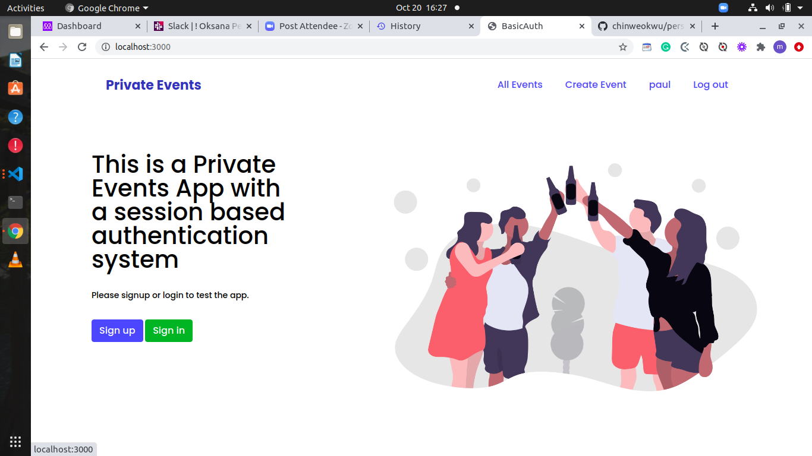
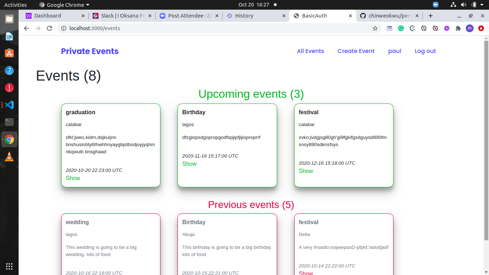
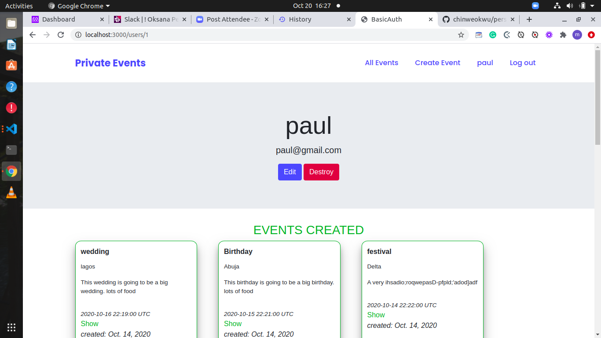
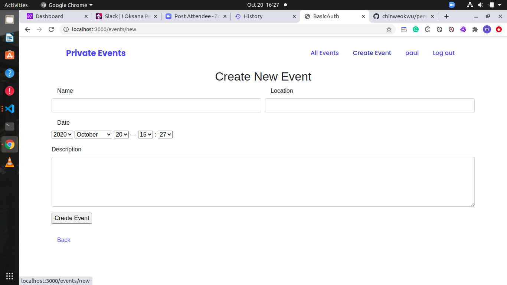

# README

## Assotiations - PRIVATE EVENTS

This project is a part of the Ruby on Rails module in the Microverse curriculum.
We build a site similar to a private Eventbrite which allows users 
to create events and then manage user signups.

- A user can register, login, logout, edit and delete own account
- A user can create many new events and attend many other events
- A user can see the list with upcoming and past events
- Each event has many attendees

### Installation
You need to have this tools to start using it:
* Ruby - 2.7.0
* Rails - 5.2.4.3
* Clone the repo git clone git clone https://github.com/chinweokwu/Private_Events
* Open your terminal and cd to the project`s folder
* Install gems with using 'bundle install'
* Run migrations with bin/rake db:migrate
* Run 'rails server' and go to your browser 'http://localhost:3000'
* For testing run 'rails console'

## Authors

👤 **Morah Paul**

- GitHub:[@github/chinweokwu](https://github.com/chinweokwu)
- Linkedin:[linkedin/morah](https://www.linkedin.com/)

👤 **Oksana Petrova**

- GitHub:[@github/Laguna1](https://github.com/Laguna1)
- Linkedin:[linkedin/OksanaPetrova](https://www.linkedin.com/in/oksana-petrova/)
- Twitter:[@OksanaP48303303](https://twitter.com/OksanaP48303303)

## 🤝 Contributing

Contributions, issues, and feature requests are welcome!
Feel free to check the [issues page]().

## Show your support

Give a ⭐️ if you like this project!